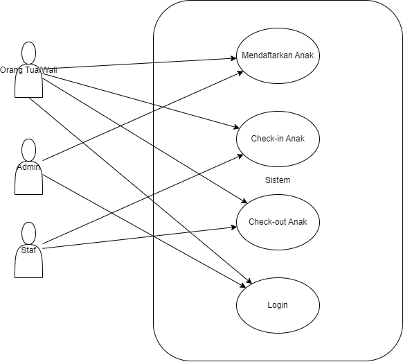
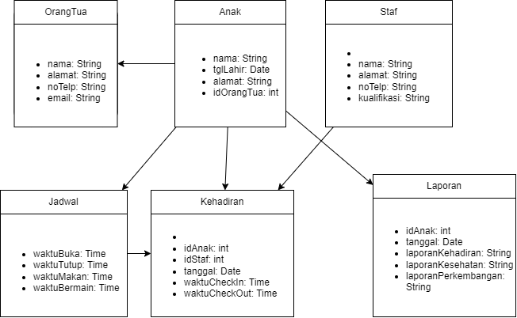
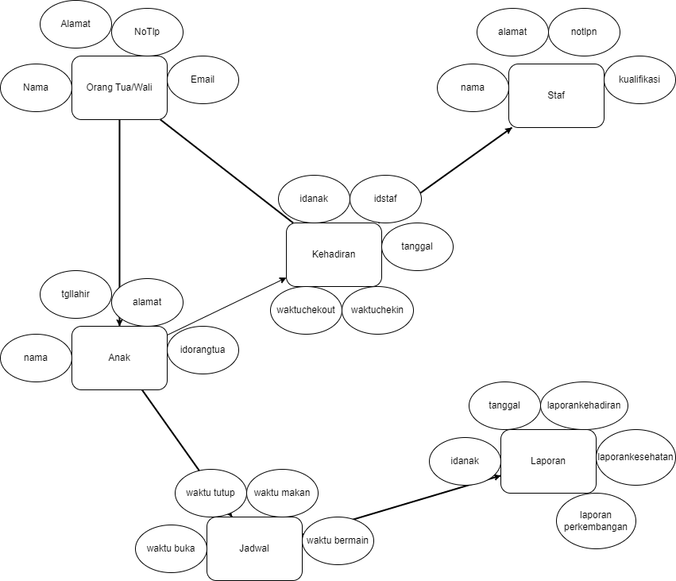

# APBO_SI_Daycare

## Use Case Diagram

Penjelasan:

Pendaftaran Anak:
Orang tua/wali mengisi formulir pendaftaran online atau offline.
Admin memverifikasi data pendaftaran.
Orang tua/wali membayar biaya pendaftaran.
Admin membuat akun untuk orang tua/wali dan anak.

Check-in Anak:
Orang tua/wali menitipkan anak kepada staf.
Staf mencatat waktu check-in anak.
Staf memastikan anak dalam keadaan sehat.

Check-out Anak:
Orang tua/wali memberitahu staf bahwa mereka ingin menjemput anak.
Staf mencatat waktu check-out anak.
Orang tua/wali menjemput anak dan menandatangani formulir penjemputan.

## Class Diagram

Penjelasan:
Class Anak:
Atribut: idAnak, nama, tglLahir, alamat, idOrangTua
Menyimpan informasi tentang anak yang terdaftar di daycare.
Class Orang Tua/Wali:
Atribut: idOrangTua, nama, alamat, noTelp, email
Menyimpan informasi tentang orang tua atau wali dari anak yang terdaftar.
Class Staf:
Atribut: idStaf, nama, alamat, noTelp, kualifikasi
Menyimpan informasi tentang staf yang bekerja di daycare.
Class Jadwal:
Atribut: idJadwal, waktuBuka, waktuTutup, waktuMakan, waktuBermain
Menyimpan informasi tentang jadwal operasional daycare.
Class Kehadiran:
Atribut: idKehadiran, idAnak, idStaf, tanggal, waktuCheckIn, waktuCheckOut
Menyimpan informasi tentang kehadiran anak di daycare.
Class Laporan:
Atribut: idLaporan, idAnak, tanggal, laporanKehadiran, laporanKesehatan, laporanPerkembangan
Menyimpan informasi tentang laporan daycare, termasuk kehadiran, kesehatan, dan perkembangan anak.

## ERD (Entity Relationship Diagram)

Penjelasan:

Orang Tua > Anak (One to Many): Seorang orang tua dapat memiliki banyak anak.
Anak > Kehadiran (One to Many): Seorang anak dapat memiliki banyak catatan kehadiran.
Staf > Kehadiran (One to Many): Seorang staf dapat mencatat kehadiran banyak anak.
Jadwal > Anak (Many to Many): Anak dapat mengikuti banyak jadwal, dan satu jadwal dapat diikuti oleh banyak anak.
Laporan > Anak (One to Many): Seorang anak dapat memiliki banyak laporan.
Staf > Jadwal (One to Many): Seorang staf memiliki banyak jadwal.
